# Ubuntu Server 24.04 LTS on Raspberry Pi – Installation Steps

> THIS CODE AND INFORMATION ARE PROVIDED "AS IS" WITHOUT WARRANTY OF ANY KIND,
> EITHER EXPRESSED OR IMPLIED, INCLUDING BUT NOT LIMITED TO THE IMPLIED
> WARRANTIES OF MERCHANTABILITY AND/OR FITNESS FOR A PARTICULAR PURPOSE.

## Write Ubuntu Image to SD Card / SSD

For better performance and reliability, it is recommended to use an SSD instead of an SD card. The installation steps are the same for both.

### 1. Install and Open Raspberry Pi Imager

To write the Ubuntu image to your SD card or SSD, you’ll need the Raspberry Pi Imager. Download it from the official website: [Raspberry Pi Imager](https://www.raspberrypi.com/software/).

### 2. Load the Ubuntu Image onto the SD Card / SSD

1. Open Raspberry Pi Imager

   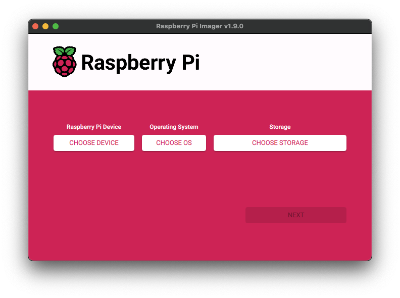

2. Choose the **Raspberry Pi Device** Model. Select the Raspberry Pi device you’re installing Ubuntu on – e.g., _Raspberry Pi 4_.

   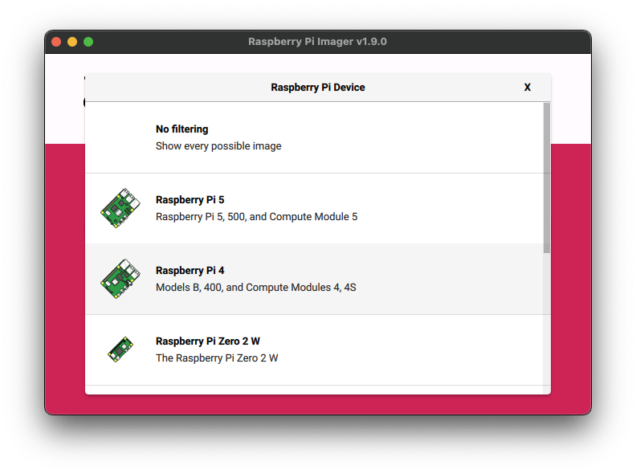

3. Select the **Operating System**. Choose Ubuntu Server 24.04.2 LTS (64-bit), located under: _Other general-purpose OS_ → _Ubuntu_

   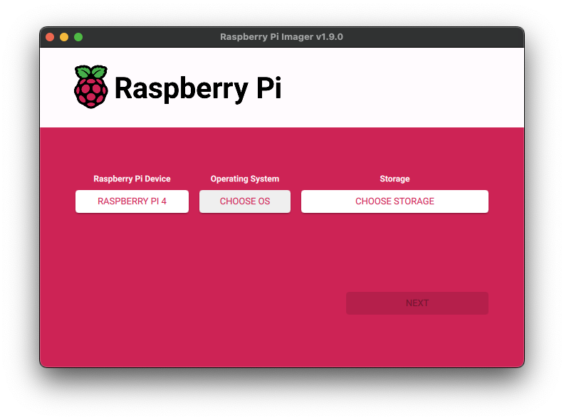 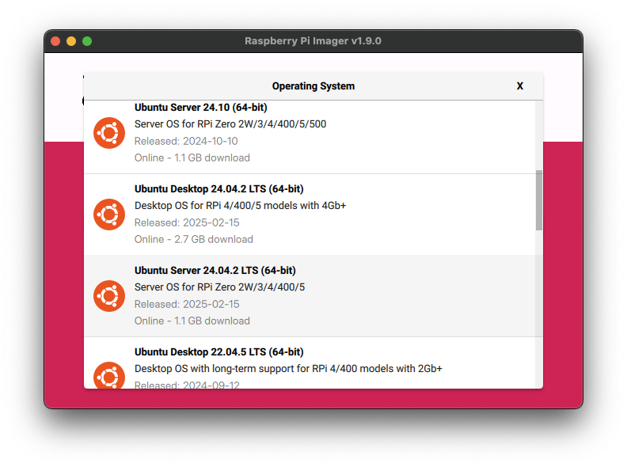

4. Select the **Storage** Device. Choose the SD card or SSD for installation – e.g., _CTX2000BX_ SSD.

    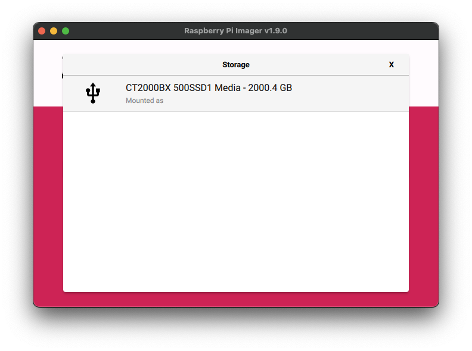

5. After clicking **Next**, the Imager will prompt you to edit settings. Click **Edit Settings** to configure the installation.

   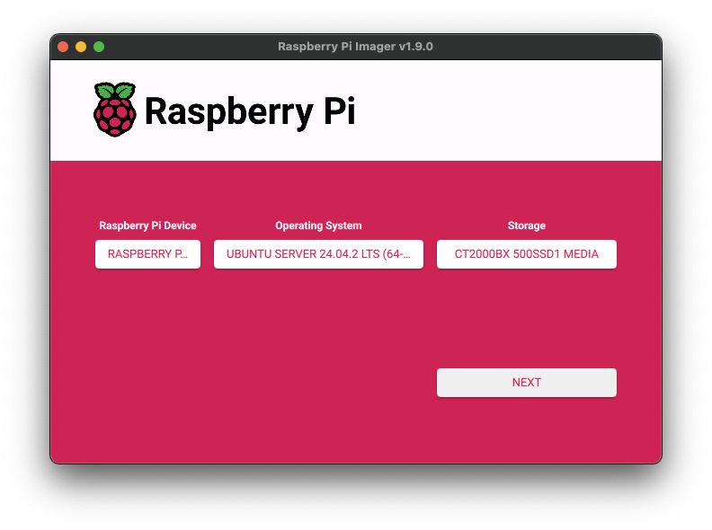 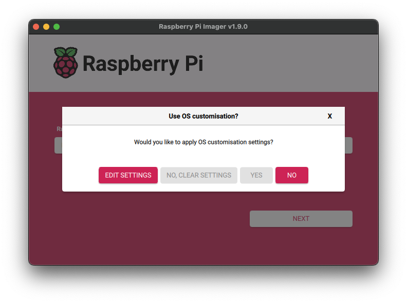

6. **Set Username and Password**. The default is ubuntu / ubuntu, but it is strongly recommended to define your own credentials.

   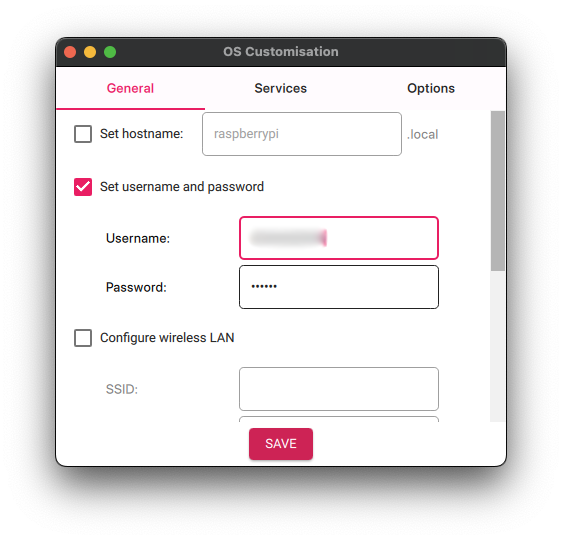

7. **Set Locale Settings**. Configure **Time zone** and **Keyboard layout**. Example: _Europe/Berlin_ and _de_ for Germany.

   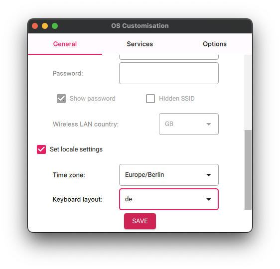

8. **Enable SSH** acess. Activate SSH using _password authentication_ (recommended during setup). This will be disabled later via the hardening script. ⚠️ Do not expose the server to the internet before hardening it. ⚠️

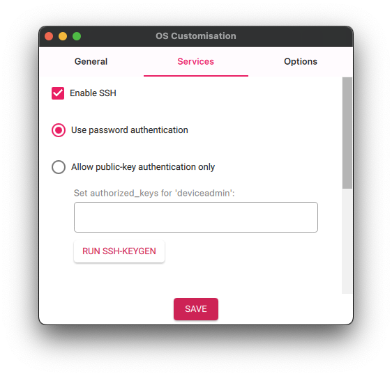

9. Enable **Eject Media When Finished**. This option will automatically eject the SD card or SSD after writing completes.

   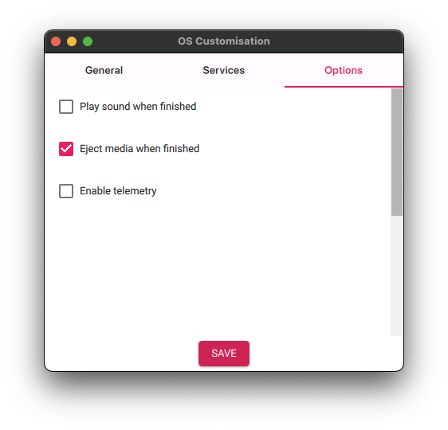

10. Write the Image. Click **YES** to begin writing the image and applying your settings.

    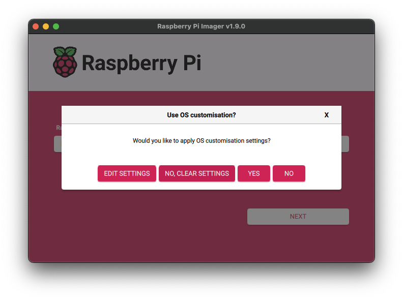

    Your operating system may ask for confirmation to overwrite the selected device and require your system password.

    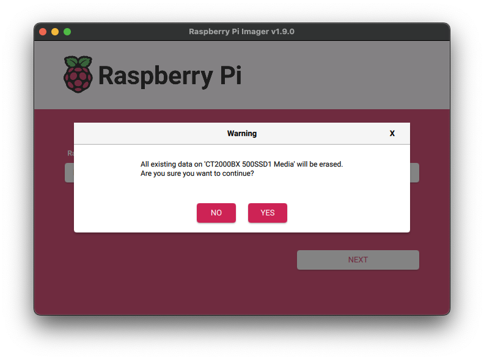 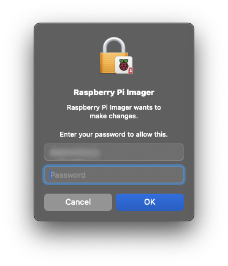

### 3. Boot the Raspberry Pi

After writing the image to the SD card or SSD, you can insert it into the Raspberry Pi and boot it up. Wait for the system to boot up. This may take a few minutes, especially if you are using an SSD. Afterwards connect to the Raspberry Pi via SSH.

## Configure the Raspberry Pi

### 1. Configure Firmware

To ensure that the Raspberry Pi 4 boots correctly, you need to configure its firmware. This is done by creating a configuration file in the `/boot/firmware` directory.

The following configuration is optimized for the Raspberry Pi 4 and Compute Module 4 (CM4) running in headless server mode (i.e., without a connected display). This setup reduces memory usage, improves performance, and lowers power consumption — ideal for server deployments.

```bash
sudo tee /boot/firmware/config.txt > /dev/null << 'EOF'
[all]
# Enable the 64-bit kernel
arm_64bit=1

# Kernel and Initramfs for Linux
kernel=vmlinuz
cmdline=cmdline.txt
initramfs initrd.img followkernel

# Disable audio, WiFi and Bluetooth
dtoverlay=disable-audio
dtoverlay=disable-wifi
dtoverlay=disable-bt

# Enable the audio output, I2C and SPI interfaces on the GPIO header. As these
# parameters related to the base device-tree they must appear *before* any
# other dtoverlay= specification
#dtparam=audio=on
#dtparam=i2c_arm=on
#dtparam=spi=on

# Minimal GPU memory for the Pi 4, which is 16MB. This is the minimum required
gpu_mem=16

# Disable the splash screen
disable_splash=1

# Comment out the following line if the edges of the desktop appear outside
# the edges of your display, important for remote control
disable_overscan=1

# Config settings specific to arm64
dtoverlay=dwc2

# Autoload overlays for any recognized cameras or displays that are attached
# to the CSI/DSI ports. Please note this is for libcamera support, *not* for
# the legacy camera stack
camera_auto_detect=0
display_auto_detect=0

# Enable the serial pins
enable_uart=1

# If you have issues with audio, you may try uncommenting the following line
# which forces the HDMI output into HDMI mode instead of DVI (which doesn't
# support audio output)
#hdmi_drive=2

# Enable the KMS ("full" KMS) graphics overlay, leaving GPU memory as the
# default (the kernel is in control of graphics memory with full KMS)
#dtoverlay=vc4-kms-v3d
#disable_fw_kms_setup=1

[pi4]
# Enable CPU Boost
arm_boost=1

# Reduce framebuffer, because of headless mode
max_framebuffers=1

# Optional: Speed up USB booting by reducing the timeout to 1 second. (For SSD boots)
usb_boot_timeout=1

[cm4]
# Enable the USB2 outputs on the IO board (assuming your CM4 is plugged into
# such a board)
dtoverlay=dwc2,dr_mode=host
EOF
```

### Configure Networking

For server deployments, it’s recommended to configure a static IP address instead of using DHCP, to ensure consistent network access.

This is done by editing the Netplan configuration, which defines the network settings for Ubuntu.

Below is an example configuration file.
Please adjust the IP address, nameservers, search domain, and default gateway according to your environment:

```bash
sudo tee /etc/netplan/99_config.yaml > /dev/null << 'EOF'
network:
  version: 2
  renderer: networkd
  ethernets:
    eth0:
      addresses:
        - '192.168.1.101/24'
      nameservers:
        addresses:
          - 192.168.1.1
        search:
          - fqdn.example.com
      routes:
        - to: 'default'
          via: '192.168.1.1'
EOF
sudo chmod 400 /etc/netplan/99_config.yaml
```

After creating your static IP configuration with Netplan, you need to apply the changes and disable any conflicting configurations from cloud-init, which may otherwise override your manual settings.

```bash
sudo rm -f /etc/netplan/50-cloud-init.yaml
sudo netplan try
```

### Reboot

After completing all configurations—firmware, networking, and disabling cloud-init—you should reboot the Raspberry Pi to apply all changes and ensure the system starts correctly with the new settings.

```bash
sudo reboot
```

## Root Partition not extended

In rare cases the root partition may not be automatically extended to use the full disk space available on the SD card or SSD. If this happens, you can manually extend the root partition using the `growpart` command.

```bash
sudo growpart /dev/sda 2
```

Afterwards, you can resize the filesystem to use the newly extended partition:

```bash
sudo resize2fs /dev/sda2
```
